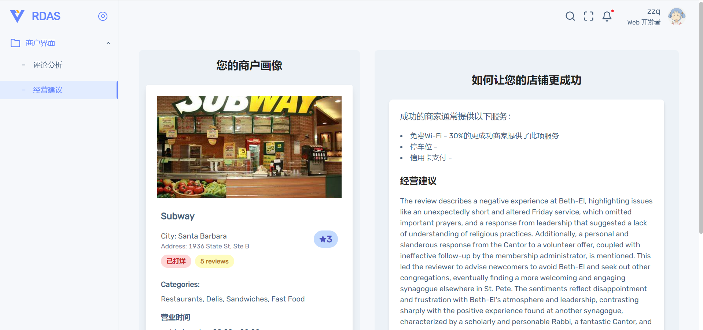

# RDAS: Review Data Analysis System

Welcome to the repository for the Review Data Analysis System (RDAS). 
This project is developed and maintained by the School of Software at Sichuan University,
used only for practical training programmes in schools.

## Summary

- The main branch maintains the big data side of this analytics system, 
written primarily using the spark framework.

- The backend branch maintains the backend of this analytics system,
written primarily using the Actix framework.

- The frontend branch maintains the frontend of this analytics system,
written primarily using the Vue2 framework.

## Disclaimer

The code in this repository is intended solely for demonstration purposes. 
It contains elements that are not designed according to best practices, 
but rather for ease of display. **We strongly advise against 
using this code in a production environment**.

## Run

```shell
git clone git@github.com:0130w/RDAS.git
```

Then create your own virtual python env and then run main.py

You'll need to tweak the contents of main.py to suit your own needs.

## Display

### Advice Page



### Search Page


### Analysis Page

